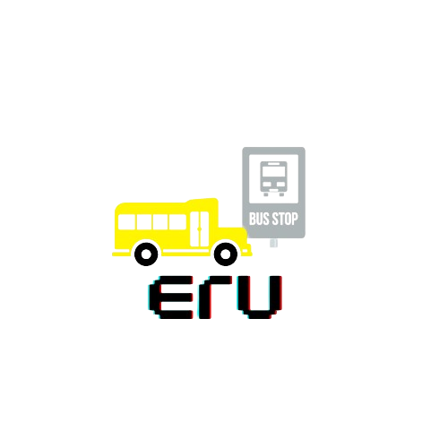
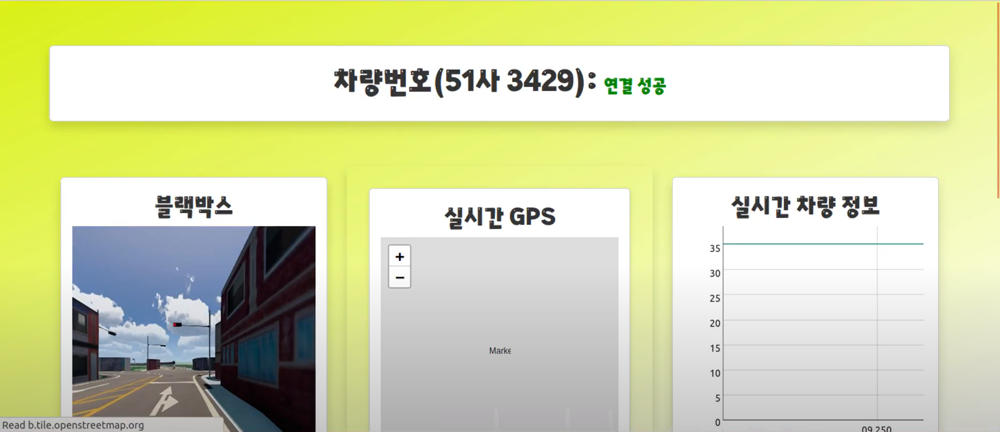
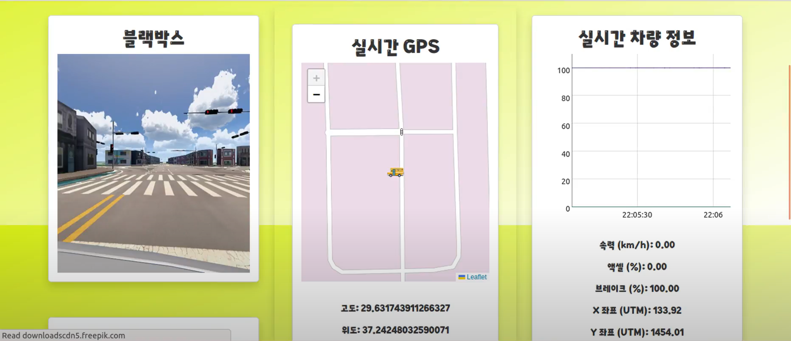
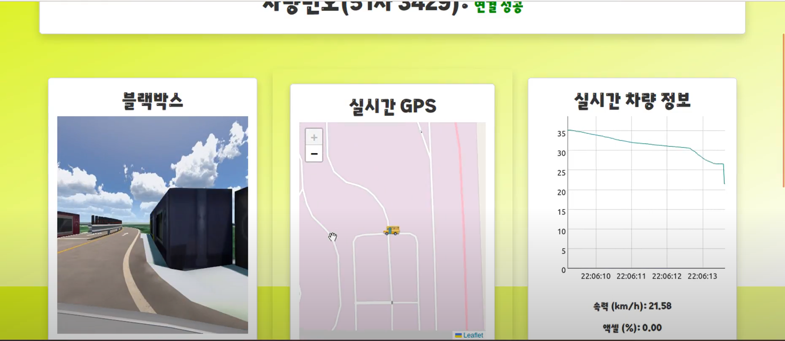
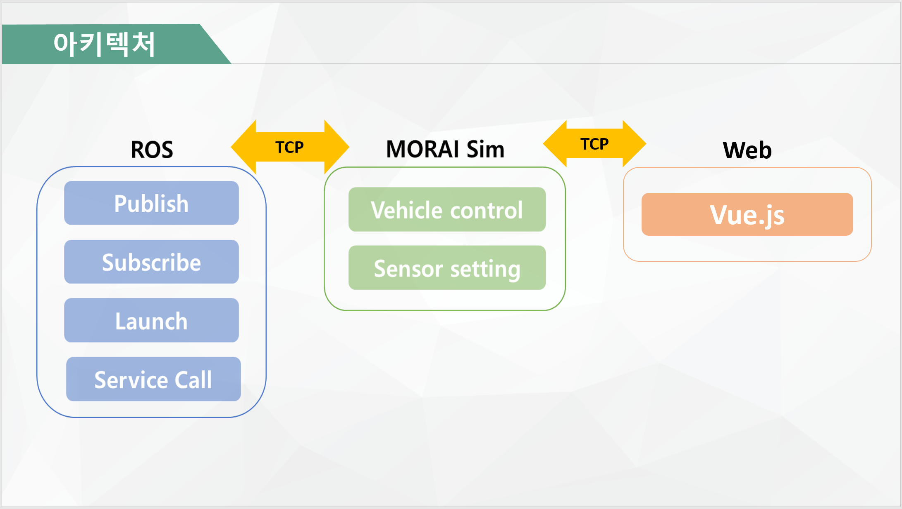

# 특화 프로젝트(모빌리티\_자율주행) - 타유(ErU)

<br>
💻SSAFY 10기 2학기 특화 프로젝트💻<br>
2024.02.19 - 2024.04.05(7주, 47일)

---

## 🐳[포팅 메뉴얼](https://lab.ssafy.com/s10-mobility-autodriving-sub2/S10P22A311/-/blob/master/exec/ErU_%ED%8F%AC%ED%8C%85%EB%A7%A4%EB%89%B4%EC%96%BC.pdf?ref_type=heads)

## 💡 프로젝트 콘셉트

👨🏻‍👩🏻‍👦🏻‍👦🏻 **자녀 안심 귀가 자율주행 모니터링 서비스** 👨🏻‍👩🏻‍👦🏻‍👦🏻

### 등하교길 자율주행 스쿨버스

- 안전하게 버스 정류장까지 자율주행
- 우회전시 일시정지
- 부족한 인력 대체
- 운행 시간 확대, 배차 시간 감소

### 우리 아이 등학교 실시간 모니터링 서비스

- 웹 화면을 통해 차량의 블랙박스 카메라, 위치, 속도 확인 가능

## ⚙️ 서비스 기능

### 인지

💡 IMU, GPS, Camera 센서를 활용


- Pedestrian Detecting(보행자 디텍팅)
- BirdView
- Semantic Segmentation

### 판단


- Global Path
- Local Path
- Localization
- Odometry
- Dijkstra

### 실시간 데이터 시각화

💡 ROS에서 publish하는 대량의 모라이 메시지 데이터를 빠르게 렌더링해서 그래프로 그리기 위해 Dygraphs 라이브러리 사용

### 실시간 맵 위치 표시

💡 실시간 위치를 빠르게 렌더링, 다양한 웹 브라우저 및 모바일에서 작동 가능한 경량 라이브러리인 Leaflet 사용

## 🏠 서비스 레이아웃

### 연결 여부



### 실시간 카메라, 맵, 차량 데이터





## 🛠️ 기술 스택

### Frontend


### Automobile(ROS)


### Management Tool


### IDE


## 🛠️서비스 아키텍처



## 📁프로젝트 구조

### ROS

```
📦final
 ┣ 📂launch
 ┃ ┗ 📜test.launch
 ┣ 📂msg
 ┃ ┗ 📜student.msg
 ┣ 📂path
 ┃ ┣ 📜kcity.txt
 ┃ ┣ 📜lc_1.txt
 ┃ ┗ 📜lc_2.txt
 ┣ 📂rviz
 ┃ ┣ 📜kcity_rviz.rviz
 ┃ ┗ 📜lane_detection_rviz.rviz
 ┣ 📂scripts
 ┃ ┣ 📂lib
 ┃ ┃ ┣ 📂__pycache__
 ┃ ┃ ┃ ┗ 📜__init__.cpython-36.pyc
 ┃ ┃ ┣ 📂mgeo
 ┃ ┃ ┃ ┣ 📂__pycache__
 ┃ ┃ ┃ ┃ ┗ 📜__init__.cpython-36.pyc
 ┃ ┃ ┃ ┣ 📂class_defs
 ┃ ┃ ┃ ┃ ┣ 📂__pycache__
 ┃ ┃ ┃ ┃ ┃ ┣ 📜__init__.cpython-36.pyc
 ┃ ┃ ┃ ┃ ┃ ┣ 📜base_line.cpython-36.pyc
 ┃ ┃ ┃ ┃ ┃ ┣ 📜base_plane.cpython-36.pyc
 ┃ ┃ ┃ ┃ ┃ ┣ 📜base_point.cpython-36.pyc
 ┃ ┃ ┃ ┃ ┃ ┣ 📜connectors.cpython-36.pyc
 ┃ ┃ ┃ ┃ ┃ ┣ 📜crosswalk.cpython-36.pyc
 ┃ ┃ ┃ ┃ ┃ ┣ 📜crosswalk_set.cpython-36.pyc
 ┃ ┃ ┃ ┃ ┃ ┣ 📜intersection_controller.cpython-36.pyc
 ┃ ┃ ┃ ┃ ┃ ┣ 📜intersection_controller_set.cpython-36.pyc
 ┃ ┃ ┃ ┃ ┃ ┣ 📜junction.cpython-36.pyc
 ┃ ┃ ┃ ┃ ┃ ┣ 📜junction_set.cpython-36.pyc
 ┃ ┃ ┃ ┃ ┃ ┣ 📜key_maker.cpython-36.pyc
 ┃ ┃ ┃ ┃ ┃ ┣ 📜lane_boundary.cpython-36.pyc
 ┃ ┃ ┃ ┃ ┃ ┣ 📜lane_boundary_set.cpython-36.pyc
 ┃ ┃ ┃ ┃ ┃ ┣ 📜line.cpython-36.pyc
 ┃ ┃ ┃ ┃ ┃ ┣ 📜line_set.cpython-36.pyc
 ┃ ┃ ┃ ┃ ┃ ┣ 📜link.cpython-36.pyc
 ┃ ┃ ┃ ┃ ┃ ┣ 📜mgeo.cpython-36.pyc
 ┃ ┃ ┃ ┃ ┃ ┣ 📜node.cpython-36.pyc
 ┃ ┃ ┃ ┃ ┃ ┣ 📜node_set.cpython-36.pyc
 ┃ ┃ ┃ ┃ ┃ ┣ 📜parking_space.cpython-36.pyc
 ┃ ┃ ┃ ┃ ┃ ┣ 📜parking_space_set.cpython-36.pyc
 ┃ ┃ ┃ ┃ ┃ ┣ 📜plane.cpython-36.pyc
 ┃ ┃ ┃ ┃ ┃ ┣ 📜plane_set.cpython-36.pyc
 ┃ ┃ ┃ ┃ ┃ ┣ 📜road_polygon.cpython-36.pyc
 ┃ ┃ ┃ ┃ ┃ ┣ 📜road_polygon_set.cpython-36.pyc
 ┃ ┃ ┃ ┃ ┃ ┣ 📜signal.cpython-36.pyc
 ┃ ┃ ┃ ┃ ┃ ┣ 📜signal_set.cpython-36.pyc
 ┃ ┃ ┃ ┃ ┃ ┣ 📜singlecrosswalk.cpython-36.pyc
 ┃ ┃ ┃ ┃ ┃ ┣ 📜singlecrosswalk_set.cpython-36.pyc
 ┃ ┃ ┃ ┃ ┃ ┣ 📜support.cpython-36.pyc
 ┃ ┃ ┃ ┃ ┃ ┣ 📜surface_marking.cpython-36.pyc
 ┃ ┃ ┃ ┃ ┃ ┣ 📜surface_marking_set.cpython-36.pyc
 ┃ ┃ ┃ ┃ ┃ ┣ 📜synced_signal.cpython-36.pyc
 ┃ ┃ ┃ ┃ ┃ ┗ 📜synced_signal_set.cpython-36.pyc
 ┃ ┃ ┃ ┃ ┣ 📜__init__.py
 ┃ ┃ ┃ ┃ ┣ 📜__init__.pyc
 ┃ ┃ ┃ ┃ ┣ 📜base_line.py
 ┃ ┃ ┃ ┃ ┣ 📜base_line.pyc
 ┃ ┃ ┃ ┃ ┣ 📜base_plane.py
 ┃ ┃ ┃ ┃ ┣ 📜base_plane.pyc
 ┃ ┃ ┃ ┃ ┣ 📜base_point.py
 ┃ ┃ ┃ ┃ ┣ 📜base_point.pyc
 ┃ ┃ ┃ ┃ ┣ 📜connectors.py
 ┃ ┃ ┃ ┃ ┣ 📜connectors.pyc
 ┃ ┃ ┃ ┃ ┣ 📜crosswalk.py
 ┃ ┃ ┃ ┃ ┣ 📜crosswalk.pyc
 ┃ ┃ ┃ ┃ ┣ 📜crosswalk_set.py
 ┃ ┃ ┃ ┃ ┣ 📜crosswalk_set.pyc
 ┃ ┃ ┃ ┃ ┣ 📜intersection_controller.py
 ┃ ┃ ┃ ┃ ┣ 📜intersection_controller.pyc
 ┃ ┃ ┃ ┃ ┣ 📜intersection_controller_set.py
 ┃ ┃ ┃ ┃ ┣ 📜intersection_controller_set.pyc
 ┃ ┃ ┃ ┃ ┣ 📜junction.py
 ┃ ┃ ┃ ┃ ┣ 📜junction.pyc
 ┃ ┃ ┃ ┃ ┣ 📜junction_set.py
 ┃ ┃ ┃ ┃ ┣ 📜junction_set.pyc
 ┃ ┃ ┃ ┃ ┣ 📜key_maker.py
 ┃ ┃ ┃ ┃ ┣ 📜key_maker.pyc
 ┃ ┃ ┃ ┃ ┣ 📜lane_boundary.py
 ┃ ┃ ┃ ┃ ┣ 📜lane_boundary.pyc
 ┃ ┃ ┃ ┃ ┣ 📜lane_boundary_set.py
 ┃ ┃ ┃ ┃ ┣ 📜lane_boundary_set.pyc
 ┃ ┃ ┃ ┃ ┣ 📜line.py
 ┃ ┃ ┃ ┃ ┣ 📜line.pyc
 ┃ ┃ ┃ ┃ ┣ 📜line_set.py
 ┃ ┃ ┃ ┃ ┣ 📜line_set.pyc
 ┃ ┃ ┃ ┃ ┣ 📜link.py
 ┃ ┃ ┃ ┃ ┣ 📜link.pyc
 ┃ ┃ ┃ ┃ ┣ 📜mgeo.py
 ┃ ┃ ┃ ┃ ┣ 📜mgeo.pyc
 ┃ ┃ ┃ ┃ ┣ 📜mgeo_item.py
 ┃ ┃ ┃ ┃ ┣ 📜mgeo_map_planner.py
 ┃ ┃ ┃ ┃ ┣ 📜node.py
 ┃ ┃ ┃ ┃ ┣ 📜node.pyc
 ┃ ┃ ┃ ┃ ┣ 📜node_set.py
 ┃ ┃ ┃ ┃ ┣ 📜node_set.pyc
 ┃ ┃ ┃ ┃ ┣ 📜parking_space.py
 ┃ ┃ ┃ ┃ ┣ 📜parking_space.pyc
 ┃ ┃ ┃ ┃ ┣ 📜parking_space_set.py
 ┃ ┃ ┃ ┃ ┣ 📜parking_space_set.pyc
 ┃ ┃ ┃ ┃ ┣ 📜plane.py
 ┃ ┃ ┃ ┃ ┣ 📜plane.pyc
 ┃ ┃ ┃ ┃ ┣ 📜plane_set.py
 ┃ ┃ ┃ ┃ ┣ 📜plane_set.pyc
 ┃ ┃ ┃ ┃ ┣ 📜road_polygon.py
 ┃ ┃ ┃ ┃ ┣ 📜road_polygon.pyc
 ┃ ┃ ┃ ┃ ┣ 📜road_polygon_set.py
 ┃ ┃ ┃ ┃ ┣ 📜road_polygon_set.pyc
 ┃ ┃ ┃ ┃ ┣ 📜signal.py
 ┃ ┃ ┃ ┃ ┣ 📜signal.pyc
 ┃ ┃ ┃ ┃ ┣ 📜signal_set.py
 ┃ ┃ ┃ ┃ ┣ 📜signal_set.pyc
 ┃ ┃ ┃ ┃ ┣ 📜singlecrosswalk.py
 ┃ ┃ ┃ ┃ ┣ 📜singlecrosswalk.pyc
 ┃ ┃ ┃ ┃ ┣ 📜singlecrosswalk_set.py
 ┃ ┃ ┃ ┃ ┣ 📜singlecrosswalk_set.pyc
 ┃ ┃ ┃ ┃ ┣ 📜support.py
 ┃ ┃ ┃ ┃ ┣ 📜support.pyc
 ┃ ┃ ┃ ┃ ┣ 📜surface_marking.py
 ┃ ┃ ┃ ┃ ┣ 📜surface_marking.pyc
 ┃ ┃ ┃ ┃ ┣ 📜surface_marking_set.py
 ┃ ┃ ┃ ┃ ┣ 📜surface_marking_set.pyc
 ┃ ┃ ┃ ┃ ┣ 📜synced_signal.py
 ┃ ┃ ┃ ┃ ┣ 📜synced_signal.pyc
 ┃ ┃ ┃ ┃ ┣ 📜synced_signal_set.py
 ┃ ┃ ┃ ┃ ┗ 📜synced_signal_set.pyc
 ┃ ┃ ┃ ┣ 📂docs
 ┃ ┃ ┃ ┃ ┗ 📜License.md
 ┃ ┃ ┃ ┣ 📂save_load
 ┃ ┃ ┃ ┃ ┣ 📂__pycache__
 ┃ ┃ ┃ ┃ ┃ ┣ 📜__init__.cpython-36.pyc
 ┃ ┃ ┃ ┃ ┃ ┗ 📜subproc_load_link_ver2.cpython-36.pyc
 ┃ ┃ ┃ ┃ ┣ 📜__init__.py
 ┃ ┃ ┃ ┃ ┣ 📜__init__.pyc
 ┃ ┃ ┃ ┃ ┣ 📜subproc_load_link_ver1.py
 ┃ ┃ ┃ ┃ ┣ 📜subproc_load_link_ver2.py
 ┃ ┃ ┃ ┃ ┗ 📜subproc_load_link_ver2.pyc
 ┃ ┃ ┃ ┣ 📂utils
 ┃ ┃ ┃ ┃ ┣ 📂__pycache__
 ┃ ┃ ┃ ┃ ┃ ┣ 📜__init__.cpython-36.pyc
 ┃ ┃ ┃ ┃ ┃ ┗ 📜version.cpython-36.pyc
 ┃ ┃ ┃ ┃ ┣ 📜__init__.py
 ┃ ┃ ┃ ┃ ┣ 📜__init__.pyc
 ┃ ┃ ┃ ┃ ┣ 📜version.py
 ┃ ┃ ┃ ┃ ┗ 📜version.pyc
 ┃ ┃ ┃ ┣ 📜README.md
 ┃ ┃ ┃ ┣ 📜__init__.py
 ┃ ┃ ┃ ┗ 📜__init__.pyc
 ┃ ┃ ┣ 📂mgeo_data
 ┃ ┃ ┃ ┣ 📂R_KR_PG_K-City
 ┃ ┃ ┃ ┃ ┣ 📜crosswalk_set.json
 ┃ ┃ ┃ ┃ ┣ 📜global_info.json
 ┃ ┃ ┃ ┃ ┣ 📜intersection_controller_data.json
 ┃ ┃ ┃ ┃ ┣ 📜intersection_controller_set.json
 ┃ ┃ ┃ ┃ ┣ 📜lane_boundary_set.json
 ┃ ┃ ┃ ┃ ┣ 📜lane_node_set.json
 ┃ ┃ ┃ ┃ ┣ 📜link_set.json
 ┃ ┃ ┃ ┃ ┣ 📜node_set.json
 ┃ ┃ ┃ ┃ ┣ 📜road_polygon_set.json
 ┃ ┃ ┃ ┃ ┣ 📜singlecrosswalk_set.json
 ┃ ┃ ┃ ┃ ┣ 📜surface_marking_set.json
 ┃ ┃ ┃ ┃ ┣ 📜synced_traffic_light_set.json
 ┃ ┃ ┃ ┃ ┣ 📜traffic_light_set.json
 ┃ ┃ ┃ ┃ ┗ 📜traffic_sign_set.json
 ┃ ┃ ┃ ┣ 📂R_KR_PR_SeongnamCityHall
 ┃ ┃ ┃ ┃ ┣ 📜crosswalk_set.json
 ┃ ┃ ┃ ┃ ┣ 📜global_info.json
 ┃ ┃ ┃ ┃ ┣ 📜intersection_controller_set.json
 ┃ ┃ ┃ ┃ ┣ 📜lane_boundary_set.json
 ┃ ┃ ┃ ┃ ┣ 📜lane_node_set.json
 ┃ ┃ ┃ ┃ ┣ 📜link_set.json
 ┃ ┃ ┃ ┃ ┣ 📜node_set.json
 ┃ ┃ ┃ ┃ ┣ 📜sim_build_data_traffic_light.csv
 ┃ ┃ ┃ ┃ ┣ 📜singlecrosswalk_set.json
 ┃ ┃ ┃ ┃ ┣ 📜surface_marking_set.json
 ┃ ┃ ┃ ┃ ┣ 📜synced_traffic_light_set.json
 ┃ ┃ ┃ ┃ ┣ 📜traffic_light_set.json
 ┃ ┃ ┃ ┃ ┗ 📜traffic_sign_set.json
 ┃ ┃ ┃ ┗ 📜bus_stop.json
 ┃ ┃ ┣ 📜__init__.py
 ┃ ┃ ┗ 📜__init__.pyc
 ┃ ┣ 📜advanced_purepursuit.py
 ┃ ┣ 📜dijkstra_path.py
 ┃ ┣ 📜get_traffic_light_status.py
 ┃ ┣ 📜gpsimu_parser.py
 ┃ ┣ 📜image_lane_fitting.py
 ┃ ┣ 📜lattice_planner.py
 ┃ ┣ 📜local_path_pub.py
 ┃ ┣ 📜mgeo_pub.py
 ┃ ┗ 📜tf_pub.py
 ┣ 📂srv
 ┃ ┗ 📜AddTwoInts.srv
 ┣ 📜CMakeLists.txt
 ┗ 📜package.xml
```

### Frontend

```
📦src
 ┣ 📂assets
 ┃ ┣ 📜logo.png
 ┃ ┗ 📜school_bus.svg
 ┣ 📂components
 ┃ ┣ 📜CameraView.vue
 ┃ ┣ 📜EgoStatus.vue
 ┃ ┣ 📜GpsStatus.vue
 ┃ ┣ 📜ImuStatus.vue
 ┃ ┣ 📜RosConnectionStatus.vue
 ┃ ┗ 📜TrafficLightStatus.vue
 ┣ 📜App.vue
 ┣ 📜HomeView.vue
 ┗ 📜main.js
```

## 📃[발표자료](./src/assets/presentation.pptx)

## 👥팀 구성원

<table align="center">
    <tr align="center">
        <td style="min-width: 250px;">
              <b>김윤지</b>
        </td>
        <td style="min-width: 250px;">
              <b>박철준</b>
        </td>
        <td style="min-width: 250px;">
              <b>부재희</b>
        </td>
        <td style="min-width: 250px;">
              <b>최창환</b>
        </td>
    </tr>
    <tr align="center">
        <td style="min-width: 250px;">
              
        </td>
        <td style="min-width: 250px;">
              
        </td>
        <td style="min-width: 250px;">
              
        </td>
        <td style="min-width: 250px;">
              
        </td>
    </tr>
    <tr align="center">
        <td>
        <b>인지, 판단, 제어</b><br> Global Path를 이용한 local Path 생성<br> UCC 및 PPT 제작 <br>전역경로 중 차량과 가장 근접한 Current Waypoint 탐색<br>차량의 상태 데이터와 장애물 데이터 수신<br>차선 변경 및 충돌 회피 알고리즘 구현
        <br/>
        </td>
        <td>
        <b>Web(Frontend)</b><br> Vue 컴포넌트 개발<br>ROS 웹 소켓 구축<br> ROS 모라이 메시지 기반 데이터 시각화 구현
        <br/>
        </td>
        <td>
        <b>인지, 제어, 판단</b><br>openCV를 활용해 line detecting 구현<br>Dijkstra 알고리즘을 활용해 global path 경로 계획 구현<br>pure pursuit 알고리즘을 활용해 local path 경로 구현<br>시연을 위한 신호등 제어<br>신호등, 버스 정류장 정보를 기반으로 정차 및 출발 기능 구현 
        <br/>
        </td>
        <td>
        <b>인지</b><br> 보행자 디텍팅<br>ROS 환경 세팅<br>Git 관리<br>발표 담당<br> PPT 디렉팅, 자료 조사
        <br/>
        </td>
    </tr>
</table>
